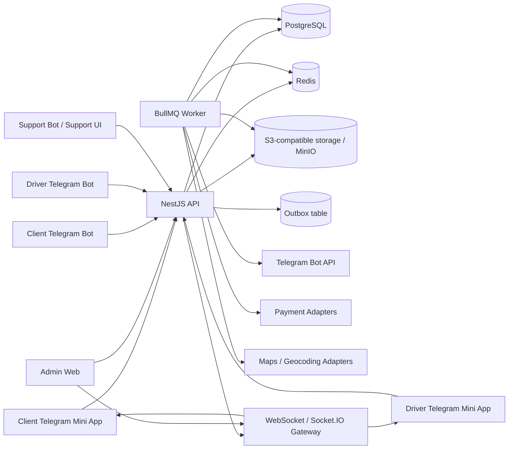
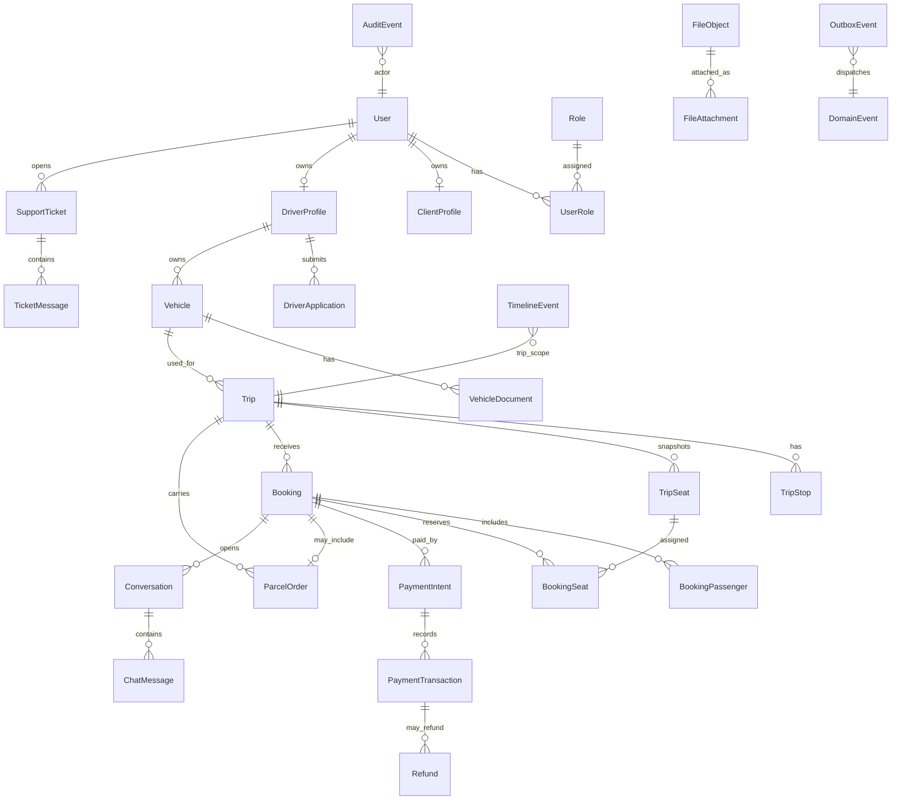
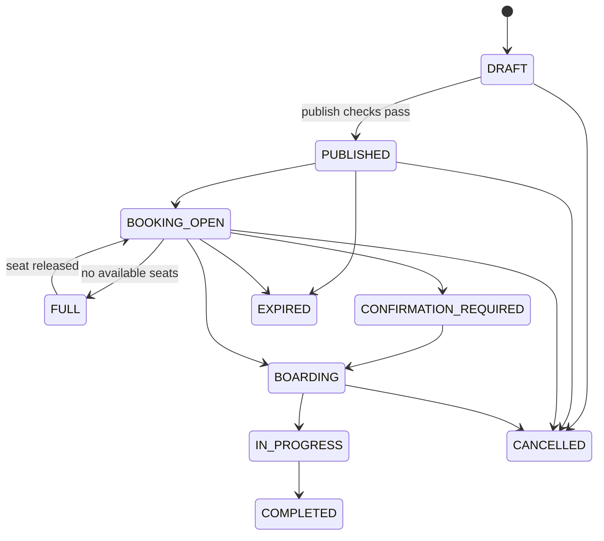
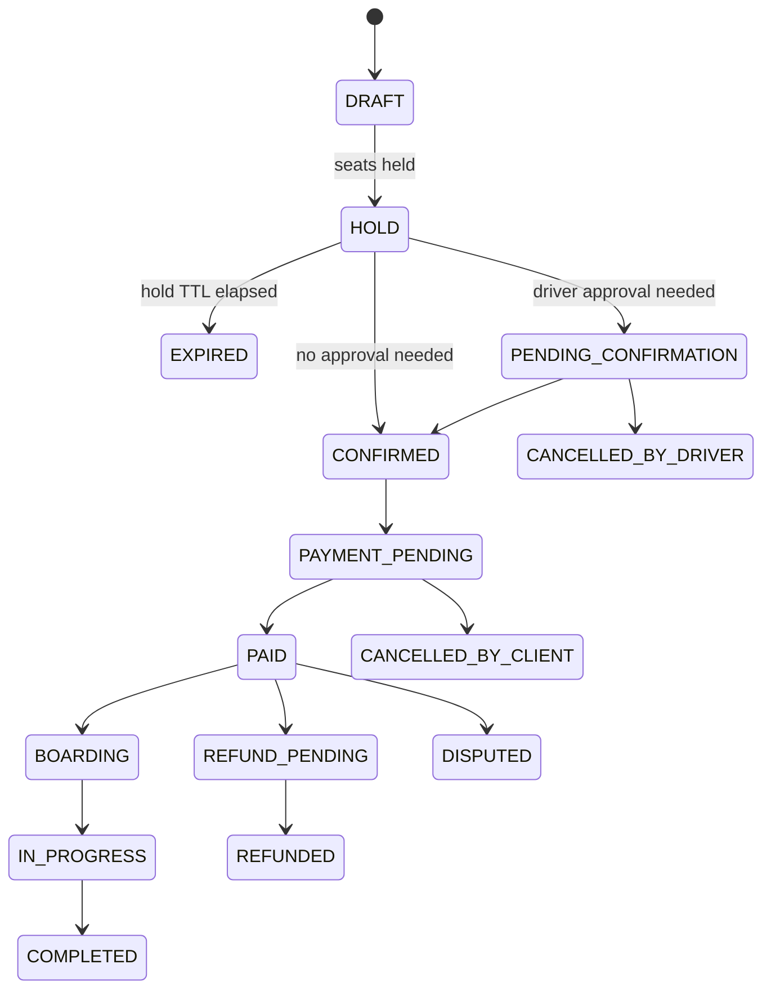
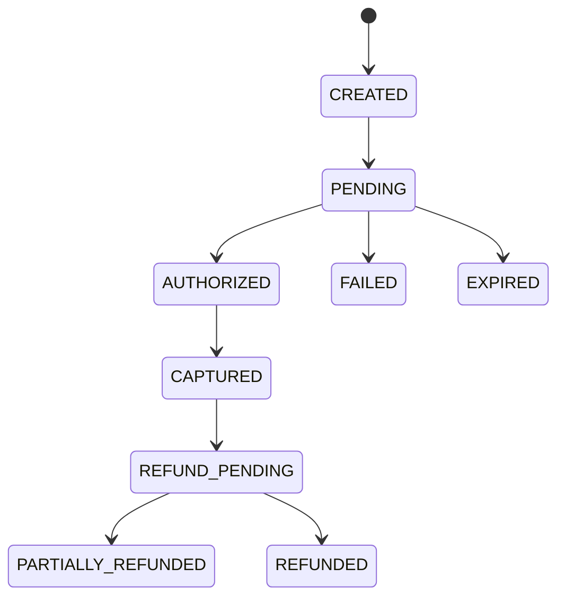
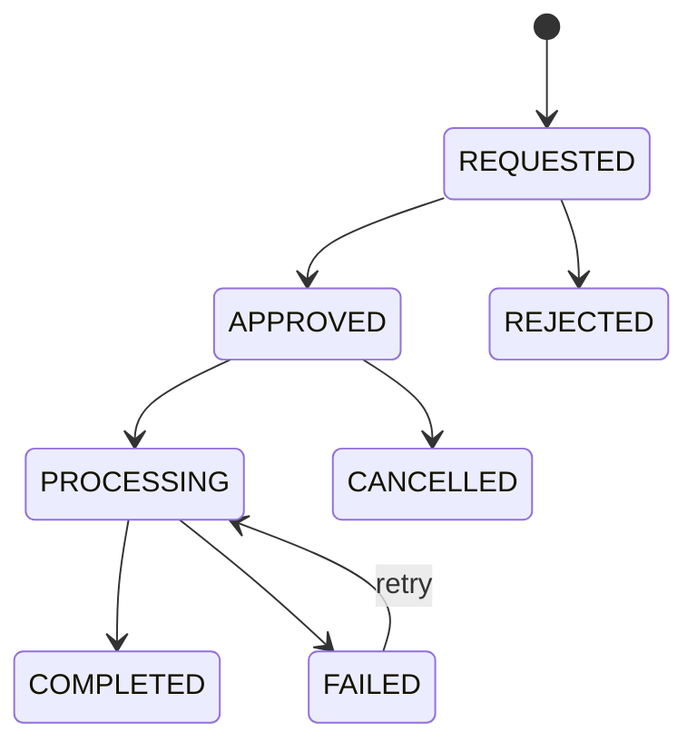
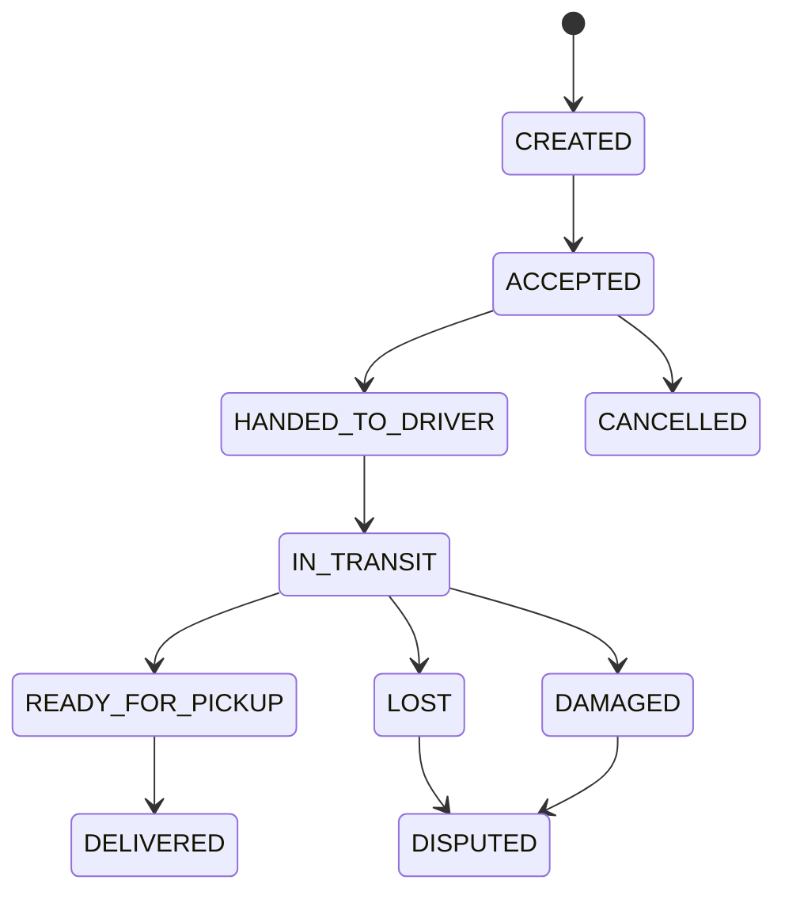
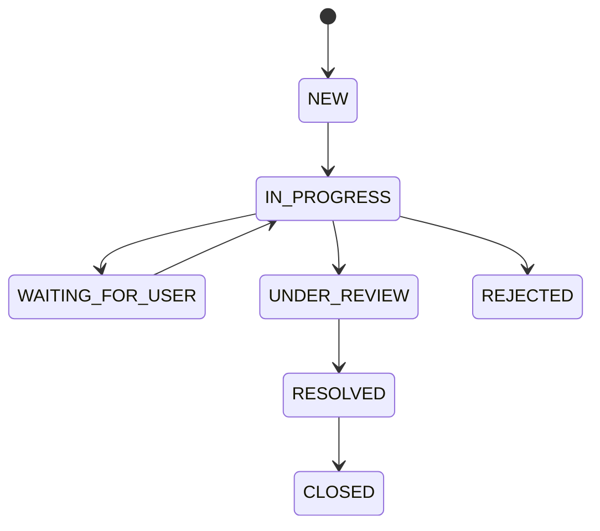
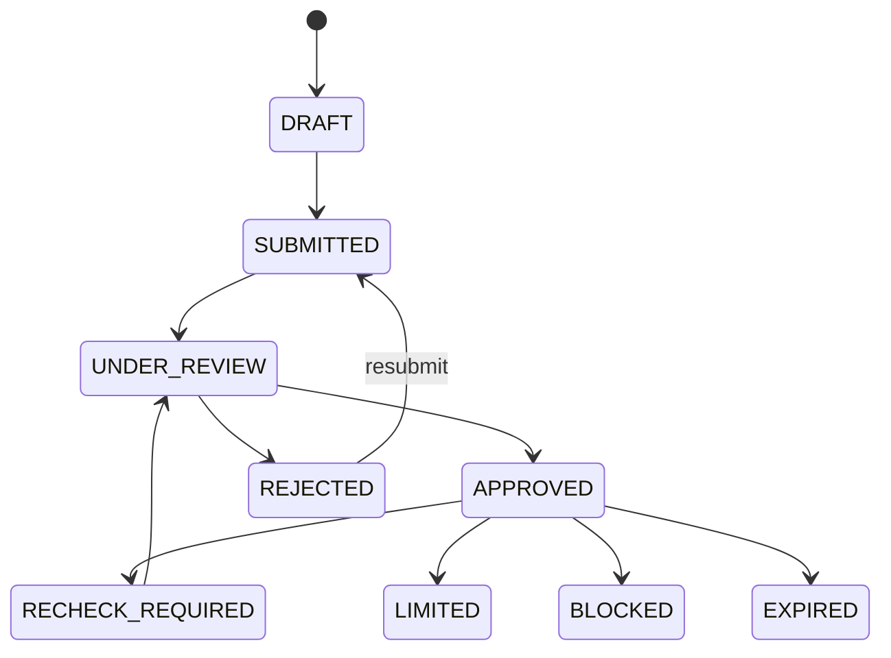
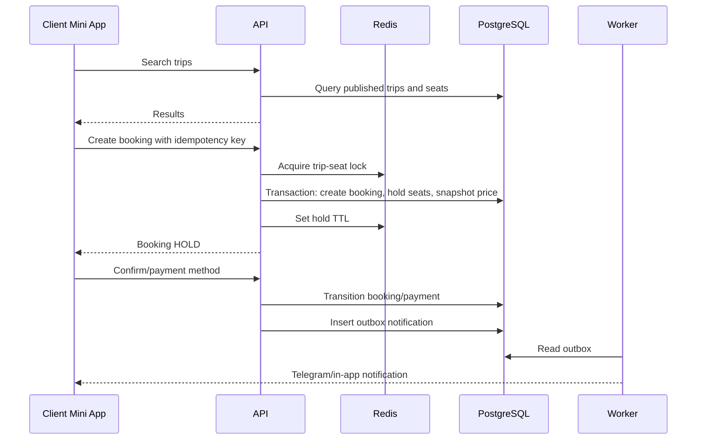

# Nodex Intercity Architecture Review

## 1. Requirement Analysis

Nodex Intercity is a Telegram-first intercity marketplace for scheduled passenger trips and small parcel delivery. The product is not a city taxi dispatcher: the core supply unit is a planned driver trip with route, stops, vehicle, seat layout, capacity, price rules, luggage rules, and booking conditions.

Primary actors:

- `CLIENT`: searches, books seats or parcel delivery, pays, chats, reviews, opens support tickets.
- `DRIVER`: passes verification, manages vehicles, creates and operates trips.
- `SUPPORT_AGENT`: handles tickets, disputes, safety events, user communications.
- `ADMIN`: moderates users, vehicles, trips, payments, refunds, content, configuration.
- `SUPER_ADMIN`: manages platform configuration, roles, permissions, sensitive operations.

MVP goals:

- Validate demand in Karakalpakstan and nearby regions of Uzbekistan.
- Minimize infrastructure cost.
- Ship a working booking and trip lifecycle quickly.
- Keep the architecture modular enough to add payments, guaranteed bookings, support depth, analytics, and new channels without rewriting the core.

Non-negotiable mechanisms:

- Telegram `initData` must be verified server-side before issuing an app session.
- Money is stored as integer minor units in `UZS`; no float for prices, fees, refunds, penalties.
- Domain timestamps are stored in UTC; display uses user locale/timezone, defaulting to `Asia/Tashkent`.
- Booking, seat hold, payment confirmation, refund, notification delivery, and admin mutations must be idempotent.
- Business rules live in backend domain modules, not only in Mini Apps.
- Critical state changes produce audit events and timeline events.
- MVP uses a modular monolith, not microservices.

## 2. Contradictions, Risks, Hidden Dependencies

### Contradictions

- Requirement asks for separate client and driver Mini Apps, but also wants minimum cost. Decision: use separate apps for product clarity, backed by shared packages and shared API modules.
- Requirement includes large admin panel scope for MVP. Decision: MVP admin panel must include only operational workflows needed to launch: driver moderation, vehicles, trips, bookings, payments/manual payment review, support tickets, audit/timeline. Other sections get schema/events and placeholder navigation later.
- Guaranteed booking, deposits, penalties, and refunds are requested architecturally, but payment provider choice may be unavailable at launch. Decision: implement payment adapter interface and manual/cash payment mode in MVP; provider integration can be added without changing booking tables.
- Chat requires media, geolocation, delivery/read status, moderation, future voice. Decision: MVP supports text, images, system messages, and audit retention; voice and group trip channel are Post-MVP.

### Risks

- Payment regulation and provider availability in Uzbekistan can affect launch sequence.
- Phone number disclosure requires explicit consent and audit trail.
- Women-only trip logic requires policy clarity: who can create, book, verify eligibility, and how disputes are handled.
- Parcel delivery creates legal and safety risk: prohibited categories, declared value, damage/loss disputes, and proof of handover must be modeled from day one.
- Weak internet makes duplicate requests likely; idempotency keys and server-side state machines are required before frontend polish.
- Seat race conditions can produce double bookings unless all holds and confirmations use database transactions plus Redis locks.

### Hidden Dependencies

- Legal documents must be versioned before user onboarding can be production-ready.
- Driver approval depends on file storage, admin moderation, audit, and notification modules.
- Booking depends on trip publication checks, seat snapshot, hold TTL, pricing snapshot, idempotency, and optional payment adapter.
- Refunds depend on cancellation policy version, payment transaction state, and audit trail.
- Analytics depends on consistent domain events and aggregates, not a BI tool.
- Localization depends on dictionary infrastructure plus localized database fields for cities, route labels, quick messages, and reference data.

## 3. Scope Split

### MVP

- Telegram auth for clients and drivers with server-side `initData` verification.
- Phone confirmation state model; actual SMS can be manual or Telegram contact sharing for first launch.
- Driver profile, documents, vehicle profile, vehicle documents, admin moderation.
- City and route directories for launch region.
- Driver trip creation: one-time trip, seat layout snapshot, prices, luggage rules, stops, draft/publish/cancel/complete.
- Trip search by route/date/seats with core filters: price, time, vehicle type, verified driver, parcel support, women-only.
- Seat hold with TTL, Redis lock, database transaction, idempotency key.
- Booking for one seat, multiple seats, whole car, and parcel.
- Manual/cash payment state and payment adapter abstraction.
- Boarding code for passenger confirmation.
- Basic parcel lifecycle with handover and pickup code.
- Client-driver chat after confirmed booking: text, images, system messages.
- Notifications through Telegram bot and in-app notification log.
- Support tickets with attachments and internal notes.
- Reviews and reliability metric source events.
- Admin panel for operational workflows.
- Audit log and entity timeline.
- Local Docker Compose: PostgreSQL, Redis, MinIO, Mailpit.

### MVP-Ready Architecture

- Payment providers, refunds, deposits, guaranteed booking, cancellation penalties.
- Waitlist and route subscriptions.
- Recurring trips and trip templates.
- Fraud signals and risk actions.
- Share trip links and trusted contacts.
- Push/email/SMS adapters.
- Maps/geocoding adapter with fallback to manual points.
- Outbox processing for notifications, analytics, audit integrations.
- OpenTelemetry hook points.
- Retention policy and data export/anonymization commands.

### Post-MVP

- Virtual telephony/masked numbers.
- Group trip channel.
- Voice messages.
- Advanced route matching with radius expansion and neighboring cities.
- Automated antifraud decisions beyond advisory flags.
- Heavy BI stack.
- Native mobile apps.
- Multi-region pricing and commission optimization.

## 4. System Architecture



Backend is a modular NestJS monolith. Each domain module owns its application services, Prisma repositories, DTO validation, state transitions, and domain events. Modules communicate through explicit service interfaces and domain events, not direct table writes across boundaries.

## 5. Modular Monolith Decision

Recommendation: use one NestJS API app plus one worker app in the same monorepo.

Why: the team gets transactional consistency for booking, seats, payments, audit, and outbox while avoiding network boundaries and deployment overhead.

Alternative: split API, bookings, payments, chat, notifications, and admin into microservices.

Trade-offs: monolith requires discipline around module boundaries; microservices would add message contracts, service discovery, distributed tracing, retries, and distributed transaction complexity before product-market validation.

Final decision: modular monolith for MVP, with modules structured so future extraction is possible around `payments`, `notifications`, `chat`, and `analytics`.

## 6. Monorepo Structure

```text
apps/
  client-mini-app/
  driver-mini-app/
  admin-web/
  api/
  worker/
  client-bot/
  driver-bot/
  support-bot/
packages/
  ui/
  config/
  database/
  contracts/
  validation/
  auth/
  telegram/
  logger/
  storage/
  payments/
  notifications/
  maps/
  i18n/
  testing/
  eslint-config/
  typescript-config/
infra/
  docker/
  scripts/
  deployment/
docs/
  architecture/
  api/
  product/
  decisions/
  diagrams/
```

Bot choice: `grammY`.

Recommendation: use `grammY` instead of Telegraf.

Why: grammY has a small composable middleware core, strong TypeScript support, active ecosystem, and good session/conversation patterns for structured bot flows.

Alternative: Telegraf.

Trade-offs: Telegraf has broader historical adoption; grammY is cleaner for typed modular bot composition.

Final decision: `grammY` for client, driver, and support bots, with shared bot middleware in `packages/telegram`.

## 7. Backend Domain Modules

- `AuthModule`: Telegram auth, session issuing, phone verification state, legal acceptance.
- `UsersModule`: users, profiles, roles, permissions, blocks.
- `DriversModule`: driver profile, verification applications, admin decisions.
- `VehiclesModule`: vehicles, seat layout templates, vehicle documents, moderation.
- `RoutesModule`: countries, regions, cities, stops, route templates.
- `TripsModule`: trip creation, publication checks, recurrence, state transitions.
- `InventoryModule`: trip seat snapshots, holds, waitlist offers.
- `BookingsModule`: booking aggregate, passengers, baggage, pricing snapshots, cancellation.
- `ParcelsModule`: parcel orders, handover, pickup code, prohibited categories.
- `PaymentsModule`: payment intents, transactions, refunds, provider adapters.
- `ChatModule`: conversations, messages, attachments, read/delivery state, reports.
- `NotificationsModule`: notification templates, delivery log, channels.
- `SupportModule`: tickets, ticket messages, internal notes, SLA timestamps.
- `ReviewsModule`: ratings, reviews, complaints.
- `ReliabilityModule`: raw metrics, formula version, score snapshots.
- `SafetyModule`: SOS events, trusted contacts, share trip links.
- `AuditModule`: audit log, timeline, admin action journal.
- `FilesModule`: object storage, signed URLs, file validation, ownership.
- `ConfigModule`: commissions, cancellation policies, reliability weights, feature flags.
- `AnalyticsModule`: domain event capture and aggregate tables.

## 8. Preliminary ER Model



## 9. Key Entities

Core identity and access:

- `User`: Telegram identity, phone, locale, timezone, status.
- `Role`, `Permission`, `UserRole`, `RolePermission`.
- `ClientProfile`, `DriverProfile`, `SupportProfile`.
- `LegalDocument`, `UserLegalAcceptance`.

Driver and vehicle:

- `DriverApplication`, `DriverApplicationDecision`.
- `DriverDocument`, `Vehicle`, `VehicleDocument`, `VehicleAmenity`.
- `SeatLayoutTemplate`, `SeatLayoutVersion`.

Trips and booking:

- `City`, `Region`, `Route`, `RouteStop`, `RouteSubscription`.
- `Trip`, `TripStop`, `TripSeat`, `TripPriceSnapshot`.
- `SeatHold`, `WaitlistEntry`, `WaitlistOffer`.
- `Booking`, `BookingPassenger`, `BookingSeat`, `BookingBaggage`, `BookingTimelineEvent`.
- `BoardingCode`, `CancellationPolicy`, `Cancellation`.

Parcel:

- `ParcelOrder`, `ParcelEvent`, `ParcelCategory`, `ProhibitedParcelCategory`, `ParcelHandoverCode`.

Payments:

- `PaymentIntent`, `PaymentTransaction`, `PaymentProviderEvent`, `Refund`, `RefundPolicySnapshot`.

Communication and support:

- `Conversation`, `ConversationParticipant`, `ChatMessage`, `ChatMessageReceipt`, `MessageReport`.
- `Notification`, `NotificationDelivery`, `NotificationTemplate`.
- `SupportTicket`, `TicketMessage`, `TicketInternalNote`, `TicketAssignment`.

Safety, trust, analytics:

- `Review`, `Complaint`, `ReliabilityMetric`, `ReliabilityFormula`, `ReliabilityScoreSnapshot`.
- `UserBlock`, `RiskSignal`, `RiskAction`.
- `TrustedContact`, `TripShareLink`, `SosEvent`.
- `AuditEvent`, `TimelineEvent`, `OutboxEvent`, `IdempotencyKey`.
- `SearchEvent`, `AnalyticsAggregate`.
- `FileObject`, `FileAttachment`.

## 10. Main Fields and Relationships

Important fields:

- `User`: `id`, `telegramId`, `telegramUsername`, `firstName`, `lastName`, `photoUrl`, `phone`, `phoneVerifiedAt`, `locale`, `timezone`, `status`, `createdAt`.
- `DriverProfile`: `userId`, `verificationStatus`, `approvedAt`, `blockedUntil`, `recheckRequiredAt`, `ratingAvg`, `reliabilityScore`.
- `Vehicle`: `driverId`, `make`, `model`, `year`, `color`, `plateNumber`, `bodyType`, `passengerSeatCount`, `moderationStatus`, `documentsExpireAt`.
- `Trip`: `driverId`, `vehicleId`, `originCityId`, `destinationCityId`, `departureAtUtc`, `arrivalEstimateAtUtc`, `status`, `typeFlags`, `pricePerSeatMinor`, `frontSeatPriceMinor`, `wholeCarPriceMinor`, `parcelPriceMinor`, `currency`, `rulesSnapshot`, `version`.
- `TripSeat`: `tripId`, `seatKey`, `label`, `row`, `column`, `seatType`, `status`, `priceMinor`, `version`.
- `SeatHold`: `tripId`, `bookingId`, `userId`, `seatKeys`, `expiresAt`, `status`, `idempotencyKey`.
- `Booking`: `tripId`, `clientId`, `type`, `status`, `currency`, `totalMinor`, `pricingSnapshot`, `termsSnapshot`, `expiresAt`, `version`.
- `PaymentIntent`: `bookingId`, `provider`, `status`, `amountMinor`, `currency`, `idempotencyKey`, `providerReference`.
- `AuditEvent`: `actorUserId`, `action`, `entityType`, `entityId`, `oldValueJson`, `newValueJson`, `reason`, `requestId`, `ipHash`, `createdAt`.

Indexes:

- Unique `User.telegramId`.
- Unique active `Vehicle.plateNumber` where not deleted.
- `Trip(originCityId, destinationCityId, departureAtUtc, status)`.
- `TripSeat(tripId, seatKey)` unique.
- `SeatHold(tripId, expiresAt, status)`.
- `Booking(clientId, status, createdAt)`.
- `PaymentIntent(provider, providerReference)` unique where provider reference exists.
- `IdempotencyKey(scope, key)` unique.
- `OutboxEvent(status, availableAt, createdAt)`.

## 11. Enums and Statuses

- `RoleCode`: `CLIENT`, `DRIVER`, `SUPPORT_AGENT`, `ADMIN`, `SUPER_ADMIN`.
- `UserStatus`: `ACTIVE`, `LIMITED`, `BLOCKED`, `DELETED`.
- `VerificationStatus`: `DRAFT`, `SUBMITTED`, `UNDER_REVIEW`, `APPROVED`, `REJECTED`, `RECHECK_REQUIRED`, `LIMITED`, `BLOCKED`, `EXPIRED`.
- `VehicleModerationStatus`: `DRAFT`, `SUBMITTED`, `APPROVED`, `REJECTED`, `RECHECK_REQUIRED`, `EXPIRED`, `BLOCKED`.
- `TripStatus`: `DRAFT`, `PUBLISHED`, `BOOKING_OPEN`, `FULL`, `CONFIRMATION_REQUIRED`, `BOARDING`, `IN_PROGRESS`, `COMPLETED`, `CANCELLED`, `EXPIRED`.
- `TripType`: `STANDARD`, `EXPRESS`, `COMFORT`, `FAMILY`, `WOMEN_ONLY`, `PARCEL_SUPPORTED`, `WHOLE_CAR`, `REGULAR`.
- `SeatStatus`: `AVAILABLE`, `HELD`, `BOOKED`, `PAID`, `OCCUPIED`, `BLOCKED`, `UNAVAILABLE`.
- `BookingType`: `SEAT`, `MULTI_SEAT`, `WHOLE_CAR`, `PARCEL`.
- `BookingStatus`: `DRAFT`, `HOLD`, `PENDING_CONFIRMATION`, `CONFIRMED`, `PAYMENT_PENDING`, `PAID`, `BOARDING`, `IN_PROGRESS`, `COMPLETED`, `CANCELLED_BY_CLIENT`, `CANCELLED_BY_DRIVER`, `CANCELLED_BY_ADMIN`, `NO_SHOW_CLIENT`, `NO_SHOW_DRIVER`, `REFUND_PENDING`, `REFUNDED`, `DISPUTED`, `EXPIRED`.
- `PaymentStatus`: `CREATED`, `PENDING`, `AUTHORIZED`, `CAPTURED`, `FAILED`, `CANCELLED`, `EXPIRED`, `REFUND_PENDING`, `PARTIALLY_REFUNDED`, `REFUNDED`.
- `RefundStatus`: `REQUESTED`, `APPROVED`, `REJECTED`, `PROCESSING`, `COMPLETED`, `FAILED`, `CANCELLED`.
- `ParcelStatus`: `CREATED`, `ACCEPTED`, `HANDED_TO_DRIVER`, `IN_TRANSIT`, `READY_FOR_PICKUP`, `DELIVERED`, `CANCELLED`, `LOST`, `DAMAGED`, `DISPUTED`.
- `TicketStatus`: `NEW`, `IN_PROGRESS`, `WAITING_FOR_USER`, `UNDER_REVIEW`, `RESOLVED`, `CLOSED`, `REJECTED`.
- `NotificationStatus`: `QUEUED`, `SENT`, `DELIVERED`, `READ`, `FAILED`, `CANCELLED`.
- `FileScanStatus`: `PENDING`, `APPROVED`, `REJECTED`, `QUARANTINED`.

## 12. State Machines

### Trip



### Booking



### Payment and Refund





### Parcel, Ticket, Driver Moderation







## 13. Main User Scenarios



Client registration:

- Mini App sends Telegram `initData`.
- `AuthModule` verifies signature with bot token.
- `User` is upserted by `telegramId`.
- User selects locale and shares phone/contact.
- User accepts current legal document versions.

Driver registration:

- Same Telegram login.
- Driver submits personal data, documents, vehicle, vehicle documents.
- Files go through `FilesModule` validation and MinIO storage.
- Admin reviews application and vehicle; decisions write `DriverApplicationDecision`, `AuditEvent`, and `TimelineEvent`.

Trip creation:

- Driver selects approved vehicle.
- API creates `Trip` in `DRAFT`.
- Driver configures route, stops, prices, seat layout.
- Publish command runs checks in `TripsModule`.
- If pass, trip becomes `PUBLISHED`/`BOOKING_OPEN`.

Boarding:

- Confirmed or paid booking receives short `BoardingCode`.
- Driver enters code.
- API verifies trip, booking, code hash, expiry, attempts.
- Booking seat moves to `OCCUPIED`; timeline event is written.

Cancellation and refund:

- Cancellation request evaluates `CancellationPolicy` snapshot.
- Booking/trip state transitions in transaction.
- Refund is created if payment was captured and policy allows.
- Notification outbox records user-facing messages.

## 14. Chat Architecture

- `Conversation` opens only after booking is confirmed or paid.
- Participants are client, driver, and optional support/admin observer.
- `ChatMessage` supports `TEXT`, `IMAGE`, `LOCATION`, `SYSTEM`; voice is schema-ready but disabled in MVP.
- `ChatMessageReceipt` stores delivered/read state per participant.
- `MessageReport` links moderation complaints to support tickets.
- Attachments use `FileObject` plus `FileAttachment`.
- Retention is policy-driven; messages are retained while disputes can be opened and then archived/anonymized according to policy.

## 15. Notification Architecture

- API never calls Telegram directly inside critical transactions.
- Domain service writes `Notification` and `OutboxEvent` in the same DB transaction.
- Worker reads outbox with `FOR UPDATE SKIP LOCKED`, sends via Telegram/in-app adapter, and writes `NotificationDelivery`.
- Deduplication key: `channel + recipientUserId + eventType + entityType + entityId + templateVersion`.

## 16. Payment Adapters

- `PaymentAdapter` interface: `createIntent`, `confirmWebhook`, `capture`, `cancel`, `refund`, `getStatus`.
- MVP providers: `manual_cash`, `manual_transfer`.
- Online provider integration later maps external events into `PaymentProviderEvent`.
- Webhook handling uses provider reference uniqueness plus idempotency key.
- Booking state is updated only after verified provider event or admin-confirmed manual payment.

## 17. Maps and Geocoding Adapters

- `MapsAdapter`: geocode, reverse geocode, route estimate, distance estimate.
- MVP supports manual city/point entry and optional coordinates.
- Avoid mandatory heavy maps on core screens; use lazy-loaded map picker only when needed.
- Store normalized point fields: `label`, `address`, `lat`, `lng`, `source`, `precision`.

## 18. Files and Attachments

- Store binaries in S3-compatible storage; metadata in `FileObject`.
- Upload flow: API creates upload intent, validates MIME/size/category, returns signed URL, finalizes file after upload.
- MVP can proxy uploads through API if signed direct upload is too much for first cut.
- File categories: driver document, vehicle photo, parcel photo, chat image, support attachment, payment receipt.
- Every attachment links to an owning entity through `FileAttachment`.

## 19. Audit and Timeline

- `AuditEvent`: administrative and sensitive changes, old/new JSON, actor, reason, request context.
- `TimelineEvent`: user-facing operational sequence for trip, booking, parcel, ticket, payment.
- Audit is immutable for application users; correction requires append-only compensating event.
- Admin panel timeline joins trip, booking, payment, parcel, chat system messages, support tickets, and refund events.

## 20. Idempotency, Transactions, Locks, Outbox

- `IdempotencyKey(scope, key, requestHash, responseJson, status, expiresAt)` stores replay results for critical commands.
- Critical command scopes: auth session, create booking, hold seats, confirm payment, cancel booking, create refund, send notification, boarding code verification.
- Seat hold transaction:
  - acquire Redis lock `trip:{tripId}:seats:{sortedSeatKeysHash}`;
  - check active holds/bookings in PostgreSQL;
  - create `Booking`, `BookingSeat`, `SeatHold`;
  - update `TripSeat.status` to `HELD`;
  - write timeline/outbox;
  - release lock after commit.
- Expired holds are released by worker using DB transaction and status check.
- Outbox events are inserted in the same transaction as domain changes.

## 21. RBAC and Permissions

RBAC uses roles plus object-level authorization.

Examples:

- `trip:create`: only approved driver with approved vehicle.
- `trip:update-own-draft`: driver owns trip and trip is not started.
- `booking:create`: active client, no blocking relationship with driver.
- `booking:cancel-own`: booking belongs to client and policy allows transition.
- `driver-application:review`: admin/support role with moderation permission.
- `payment:manual-confirm`: admin permission plus reason required.
- `audit:read`: admin/super admin only.
- `support-ticket:add-internal-note`: support/admin only; never exposed to ticket author.

## 22. Personal Data Retention

- Phone disclosure consent is stored in `PhoneDisclosureConsent` with requester, recipient, booking, accepted version, expiry.
- Chat and support content retention is policy-configured.
- User deletion performs anonymization where legal/operational records must remain: trips, payments, audit, disputes.
- Files with expired legal need are queued for deletion from object storage.
- Data export job collects user profile, bookings, parcels, tickets, consents, chat records within policy boundaries.

## 23. Localization Strategy

- Use `next-intl` for Next.js apps.
- Locale codes: `ru`, `uz`, `kaa`.
- Recommendation: use `kaa` for Karakalpak because ISO 639 assigns `kaa` to Karakalpak; avoid `kk`, which is Kazakh.
- Store UI strings in dictionaries, not components.
- Store localized reference data in JSON fields or child translation tables: cities, amenities, parcel categories, quick messages, legal document titles.

## 24. Testing Strategy

- Unit tests: state machines, pricing, cancellation policy, reliability formula, Telegram initData validation.
- Integration tests: booking hold transaction, expired hold release, payment webhook idempotency, outbox delivery.
- API tests: auth, trip search, booking, driver moderation, support ticket.
- E2E Playwright: client search-book-pay/confirm flow, driver create trip flow, admin approve driver flow.
- Contract tests: shared DTO schemas in `packages/contracts`.

## 25. Environments

- `local`: Docker Compose, seed data, MinIO, Redis, PostgreSQL, Mailpit, test bot tokens.
- `development`: shared dev database, deployed preview apps, sandbox bot/payment credentials.
- `staging`: production-like infra, migration rehearsal, real Telegram bot test environment, restricted admin users.
- `production`: managed PostgreSQL backups, Redis persistence policy, object storage lifecycle rules, audited secrets, monitoring.

## 26. Local Docker Compose Proposal

Services:

- `postgres`: database, exposed locally.
- `redis`: locks, cache, BullMQ.
- `minio`: S3-compatible object storage.
- `mailpit`: email adapter testing.
- `api`: NestJS API.
- `worker`: BullMQ worker.
- `client-mini-app`, `driver-mini-app`, `admin-web`: Next.js apps.

Volumes:

- `postgres_data`
- `redis_data`
- `minio_data`

## 27. Migration and Seed Plan

Migration phases:

1. Identity, RBAC, legal documents.
2. Cities/routes/reference data.
3. Driver, documents, vehicles, files.
4. Trips, seats, seat layouts.
5. Bookings, holds, passengers, baggage.
6. Payments, refunds, cancellation policies.
7. Parcels.
8. Chat, notifications, support.
9. Audit, timeline, outbox, analytics.

Seed:

- Roles and permissions.
- Launch cities and common routes.
- Seat layout templates.
- Amenities and parcel categories.
- Cancellation policy default.
- Reliability formula default.
- Legal document placeholder versions marked `requires_legal_review`.
- Super admin invite/bootstrap command.

## 28. Development Roadmap

1. Foundation: monorepo, configs, env validation, database, Docker Compose.
2. Identity: Telegram auth, users, roles, legal acceptance.
3. Driver onboarding: profiles, files, vehicles, moderation admin.
4. Trip supply: route directories, trip drafts, publication checks, seat snapshots.
5. Demand and booking: search, hold, booking, passenger/baggage data.
6. Payments MVP: manual payment/cash, payment abstraction, booking confirmation.
7. Operations: boarding code, trip lifecycle, cancellation, basic refunds.
8. Parcel MVP: parcel order, handover, pickup code, events.
9. Communication: chat, notifications, support tickets.
10. Trust and safety: reviews, reliability metrics, blocks, SOS ticket creation.
11. Analytics and hardening: aggregates, audit views, E2E, performance, backups.
12. Staging and launch: migration rehearsal, bot setup, admin training, production checklist.

## 29. Definition of Done by Stage

- Foundation: app starts with one command; lint/typecheck pass; env validation rejects missing secrets.
- Identity: Telegram initData tests pass; user can create session; legal acceptance recorded.
- Driver onboarding: admin can approve/reject with reason; files stored; audit records written.
- Trip supply: approved driver can publish valid trip; invalid trip publish fails with specific reason.
- Booking: two simultaneous requests cannot book same seat; expired holds release seats.
- Payment MVP: manual payment confirmation is idempotent and audited.
- Operations: boarding code cannot be reused; trip completion updates related bookings.
- Parcel: handover and delivery codes are verified and logged.
- Chat/support: only eligible participants access conversation/ticket; internal notes hidden.
- Hardening: critical E2E flows pass; backup and restore runbook exists; staging migration succeeds.

## 30. Required ADRs

- ADR-001: Modular monolith over microservices for MVP.
- ADR-002: pnpm + Turborepo monorepo layout.
- ADR-003: NestJS + Prisma + PostgreSQL backend stack.
- ADR-004: Redis locks, hold TTL, and BullMQ worker model.
- ADR-005: Integer money representation in UZS minor units.
- ADR-006: UTC storage and timezone display policy.
- ADR-007: Telegram initData server verification.
- ADR-008: grammY for Telegram bots.
- ADR-009: S3-compatible file storage with MinIO locally.
- ADR-010: Outbox pattern for notifications and domain events.
- ADR-011: Payment adapter abstraction and manual payment MVP.
- ADR-012: `kaa` locale code for Karakalpak.
- ADR-013: Audit log and append-only timeline strategy.
- ADR-014: RBAC plus object-level authorization.
- ADR-015: Data retention, anonymization, and export policy.

## Final Status

STATUS: ARCHITECTURE_REVIEW_COMPLETED

No blocking product decisions are required to start foundation work. Recommended defaults:

- Use manual/cash payment first, keep online payment provider behind adapter.
- Use `kaa` for Karakalpak locale.
- Use one API app plus one worker app for MVP.
- Use `grammY` for bots.
- Use MinIO locally and S3-compatible storage in production.
